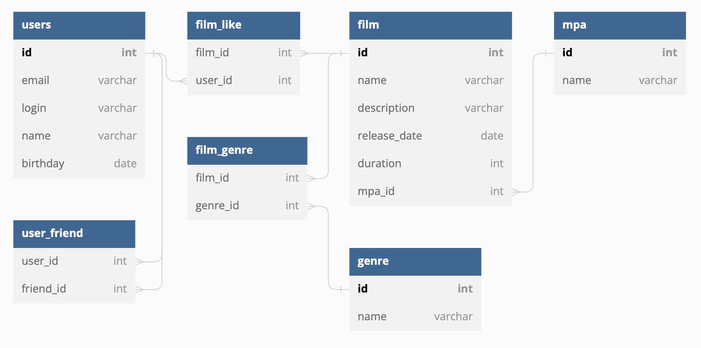

# JAVA-FILMORATE

This project is an API service that works with movies and user ratings, and also returns the top movies recommended for viewing. Users have the opportunity to add each other as friends and like movies.

Technologies: 
* Java 11
* Spring Boot
* Maven
* H2 database
* SQL
* Lombok
* JUnit

### TESTING

Project functionality was checked by unit testing using JUnit 5. All tests are in [this](src/test/java/ru/yandex/practicum/filmorate) directory.

---
### DATABASE STRUCTURE ER-DIAGRAM

---
### REQUEST EXAMPLES FOR BASIC OPERATIONS

| method | path                                 | purpose                                                                  |
|--------|--------------------------------------|--------------------------------------------------------------------------|
| POST   | /users                               | adds new user                                                            |
| GET    | /users/{id}                          | returns user with specified **_id_**                                     |
| PUT    | /users                               | updates existing user                                                    |
| GET    | /users                               | returns all users                                                        |
| PUT    | /users/{id}/friends/{friendId}       | **_friendId_** user becomes friend to **_id_** user                      |
| DELETE | /users/{id}/friends/{friendId}       | undo request above                                                       |
| GET    | /users/{id}/friends/common/{otherId} | returns users who are friends with both **_id_** and **_otherId_** users |
| GET    | /users/{id}/friends                  | returns friends of user with specified id                                |
| POST   | /films                               | adds new film                                                            |
| GET    | /films/{id}                          | returns film with specified **_id_**                                     |
| PUT    | /films                               | updates existing film                                                    |
| GET    | /films                               | returns all films                                                        |
| PUT    | /films/{id}/like/{userId}            | adds **_userId_** like to **_id_** film                                  |
| DELETE | /films/{id}/like/{userId}            | undo request above                                                       |
| GET    | /films/popular                       | returns top 10 (number can be changed with path parameter) films         |
| GET    | /genres/{id}                         | returns genre with specified **_id_**                                    |
| GET    | /genres                              | returns all genres                                                       |
| GET    | /mpa/{id}                            | returns mpa with specified **_id_**                                      |
| GET    | /mpa                                 | returns all mpa                                                          |

